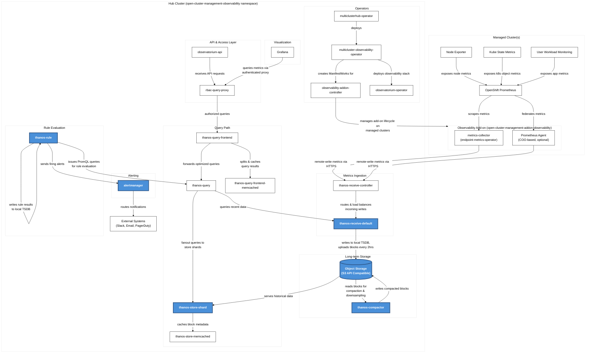

# Red Hat Advanced Cluster Management 2.15 - Observability Architecture

## Complete Component Diagram

## Component Legend

| Symbol | Meaning |
|--------|---------|
| 🔵 Blue boxes | Components requiring persistent storage |
| ⬜ White boxes | Stateless components |
| Arrows | Data flow with relationship description |

## Components Requiring Storage (Colored Blue)

| Component | Storage Type | Purpose |
|-----------|--------------|---------|
| **thanos-receive-default** | Persistent Volume | Writes incoming metrics to local Prometheus TSDB. Acts as a local cache before uploading to object storage every 2 hours. |
| **thanos-compactor** | Persistent Volume | Needs local disk for intermediate data during compaction, downsampling, and bucket state cache. |
| **thanos-rule** | Persistent Volume | Stores rule evaluation results on disk in Prometheus 2.0 storage format. Retention configurable via `RetentionInLocal`. |
| **thanos-store-shard** | Persistent Volume | Keeps small amount of remote block metadata locally. Syncs with bucket on startup. |
| **alertmanager** | Persistent Volume | Stores nflog (notification log) data and silenced alerts. nflog is an append-only log of active/resolved notifications. |
| **Object Storage** | S3-compatible | Primary long-term storage for all metrics and metadata. Stores TSDB blocks uploaded by thanos-receive. |

## Stateless Components

| Component | Description |
|-----------|-------------|
| **multiclusterhub-operator** | Root operator that deploys multicluster-observability-operator |
| **multicluster-observability-operator** | Deploys and manages the entire observability stack |
| **observability-addon-controller** | Manages observability add-on lifecycle on managed clusters via ManifestWorks |
| **observatorium-operator** | Manages Observatorium components |
| **thanos-receive-controller** | Routes and load-balances incoming remote-write requests to receive replicas |
| **thanos-query** | Performs distributed queries across store shards and receivers |
| **thanos-query-frontend** | Query caching, splitting, and optimization layer |
| **thanos-store-memcached** | In-memory cache for store shard block metadata |
| **thanos-query-frontend-memcached** | In-memory cache for query results |
| **observatorium-api** | API gateway for external access |
| **rbac-query-proxy** | Enforces RBAC policies on metric queries |
| **Grafana** | Visualization dashboards (config stored as ConfigMaps) |
| **metrics-collector** | Collects metrics from OCP Prometheus and remote-writes to hub |
| **Prometheus Agent** | COO-based collector for new multicluster observability add-on |

## Data Flow Summary

### Metrics Collection Flow
1. **Node Exporter** & **Kube State Metrics** expose system and Kubernetes object metrics
2. **OpenShift Prometheus** scrapes metrics from exporters and user workloads
3. **metrics-collector** (or **Prometheus Agent**) federates/scrapes from OCP Prometheus
4. Metrics are **remote-written via HTTPS** to **thanos-receive-controller** on hub cluster
5. **thanos-receive-default** writes to local TSDB and uploads blocks to **Object Storage** every 2 hours

### Query Flow
1. **Grafana** user initiates query
2. Query passes through **rbac-query-proxy** for authorization
3. **thanos-query-frontend** caches and optimizes query
4. **thanos-query** fans out to:
   - **thanos-receive-default** for recent data (< 2 hours)
   - **thanos-store-shard** for historical data from Object Storage
5. Results are aggregated and returned

### Alerting Flow
1. **thanos-rule** evaluates Prometheus alerting/recording rules
2. Rules query data via **thanos-query**
3. Firing alerts are sent to **alertmanager**
4. **alertmanager** deduplicates, groups, and routes notifications to external systems

## Component Versions (ACM 2.15)

| Component | Version |
|-----------|---------|
| Grafana | 12.2.0 |
| Thanos | 0.39.2 |
| Prometheus Alertmanager | 0.28.1 |
| Prometheus | 3.5.0 |
| Prometheus Operator | 0.85.0 |
| Kube State Metrics | 2.17.0 |
| Node Exporter | 1.9.1 |
| Memcached Exporter | 0.15.3 |
