## Architecture of the ACM 2.15 Observability

```mermaid
%%{init: {'theme': 'base', 'themeVariables': { 'background': '#ffffff', 'lineColor': '#333333', 'textColor': '#333333', 'primaryTextColor': '#333333' }}}%%
flowchart TB
    subgraph HUB["Hub Cluster - open-cluster-management-observability namespace"]

        subgraph MANAGED["Managed Clusters"]
            MC[metrics-collector]
        end

        MC -- "Remote Write" --> TRC[thanos-receive-controller]
        TRC -- "Routes to" --> TRD[thanos-receive-default]

        TRD -- "Writes to local TSDB" --> TRD_PV[(Thanos Receive PV)]
        TRD -- "Uploads blocks every 2hrs" --> OS[(Object Storage<br/>S3 API Compatible)]

        OS -- "Compaction & Downsampling" --> TC[thanos-compactor]
        TC -- "Intermediate data" --> TC_PV[(Thanos Compactor PV)]

        OS -- "Block access" --> TSS[thanos-store-shard]
        TSS -- "Block info cache" --> TSS_PV[(Thanos Store PV)]
        TSS -- "Uses cache" --> TSM[thanos-store-memcached]

        subgraph QUERY["Query Path"]
            TQF[thanos-query-frontend]
            TQ[thanos-query]
            TQFM[thanos-query-frontend-memcached]
        end

        TQF -- "Query caching" --> TQFM
        TQF -- "Forwards queries" --> TQ
        TQ -- "Fanout queries" --> TSS
        TQ -- "Queries rule results" --> TR

        TR[thanos-rule] -- "Issues queries" --> TQ
        TR -- "Evaluates rules & generates alerts" --> AM[alertmanager]
        TR -- "Rule results" --> TR_PV[(Thanos Ruler PV)]

        AM -- "Stores nflog & silences" --> AM_PV[(Alertmanager PV)]

        subgraph API["API Layer"]
            OA[observatorium-api]
            RBAC[rbac-query-proxy]
        end

        RBAC -- "Authorized queries" --> TQF
        OA -- "API requests" --> RBAC

        G[Grafana] -- "Queries via" --> RBAC
    end

    %% Style definitions - soft muted colors for readability
    classDef cluster fill:#f5e6e8,stroke:#8b4557,stroke-width:2px,color:#5a2d3a
    classDef thanos fill:#e8eef5,stroke:#4a6785,stroke-width:2px,color:#2d3e52
    classDef storage fill:#e6f2e6,stroke:#4a7c59,stroke-width:2px,color:#2d4a35
    classDef alerting fill:#fdf2e6,stroke:#b8860b,stroke-width:2px,color:#5c4306
    classDef visualization fill:#f0e6f5,stroke:#7a5a8c,stroke-width:2px,color:#4a3552
    classDef pv fill:#d4edda,stroke:#28a745,stroke-width:2px,color:#155724
    classDef memcached fill:#fff3cd,stroke:#856404,stroke-width:1px,color:#856404
    classDef api fill:#e2e3e5,stroke:#6c757d,stroke-width:2px,color:#383d41

    %% Apply styles
    class MC cluster
    class TRC,TRD,TC,TSS,TR,TQ,TQF thanos
    class OS storage
    class AM alerting
    class G visualization
    class AM_PV,TC_PV,TR_PV,TRD_PV,TSS_PV pv
    class TSM,TQFM memcached
    class OA,RBAC api

    %% Link styles - black arrows with visible text
    linkStyle default stroke:#333333,stroke-width:1.5px,color:#000000
```

## Components Requiring Persistent Storage

| Component | PV Required | Purpose |
|-----------|-------------|---------|
| **alertmanager** | Yes | Stores nflog data and silenced alerts. nflog is an append-only log of active and resolved notifications. |
| **thanos-compactor** | Yes | Needs local disk for intermediate data during compaction and bucket state cache. Space depends on underlying block sizes. |
| **thanos-rule** | Yes | Stores rule evaluation results on disk in Prometheus 2.0 storage format. Retention configurable via `RetentionInLocal`. |
| **thanos-receive-default** | Yes | Writes incoming metrics to local Prometheus TSDB. Acts as local cache before uploading to object storage every 2 hours. |
| **thanos-store-shard** | Yes | Keeps small amount of remote block info locally. Safe to delete across restarts at cost of increased startup time. |
| thanos-query | No | Stateless - performs query fanout to store and rule components. |
| thanos-query-frontend | No | Stateless - query caching handled by memcached. |
| thanos-receive-controller | No | Stateless - routes incoming metrics to receive replicas. |
| observatorium-api | No | Stateless API gateway. |
| rbac-query-proxy | No | Stateless RBAC proxy. |
| Grafana | No | Dashboards stored as ConfigMaps. |
| Memcached instances | No | In-memory caching only. |

## Storage Guidelines

### Do's

| Component | Recommendation |
|-----------|----------------|
| **All PV Components** | Use Block Storage similar to what Prometheus uses. |
| **All PV Components** | Each replica must have its own dedicated PV - do not share PVs between replicas. |
| **All PV Components** | Define a storage class in `MultiClusterObservability` CR if no default exists or you need non-default storage. |
| **thanos-receive & thanos-rule** | Ensure persistent volumes remain accessible to avoid data loss. |
| **thanos-compactor** | Give persistent disks to effectively use bucket state cache between restarts. |
| **Object Storage** | Use S3-compatible object storage for long-term metrics and metadata storage. |
| **Object Storage** | Red Hat OpenShift Data Foundation is fully supported. |

### Don'ts

| Component | Warning |
|-----------|---------|
| **All PV Components** | Do NOT use local storage operator or storage classes that use local volumes. Data loss occurs if pod relaunches on different node. |
| **thanos-receive & thanos-rule** | Do NOT lose access to PVs - this causes data loss. |
| **thanos-compactor** | Do NOT delete on-disk data while running. Safe to delete between restarts only if compactor is crash-looping. |
| **Object Storage** | Do NOT use unsupported object stores. Use Thanos-supported, stable S3-compatible stores. |

## Component Versions (ACM 2.15)

| Component | Version |
|-----------|---------|
| Grafana | 12.2.0 |
| Thanos | 0.39.2 |
| Prometheus Alertmanager | 0.28.1 |
| Prometheus | 3.5.0 |
| Prometheus Operator | 0.85.0 |
| Kube State Metrics | 2.17.0 |
| Node Exporter | 1.9.1 |
| Memcached Exporter | 0.15.3 |