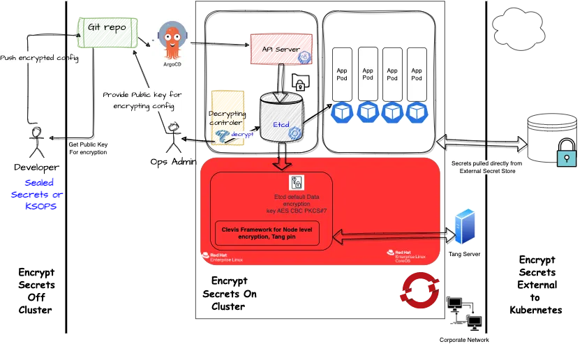
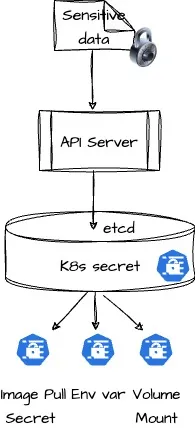
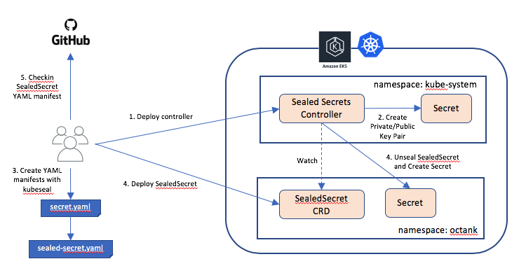

# Content for the workshop and demo

Red Hat blog explaining multiple ways in which secrets can be encrypted.

https://www.redhat.com/en/blog/holistic-approach-to-encrypting-secrets-both-on-and-off-your-openshift-clusters 




## Concept
> Content is picked from the SealedSecret's Github repository.

### Problem: "I can manage all my K8s config in git, except Secrets."

#### Solution: Encrypt your Secret into a SealedSecret, which is safe to store - even inside a public repository. The SealedSecret can be decrypted only by the controller running in the target cluster and nobody else (not even the original author) is able to obtain the original Secret from the SealedSecret.




Diagram taken from AWS blog: https://aws.amazon.com/blogs/opensource/managing-secrets-deployment-in-kubernetes-using-sealed-secrets/


## Scope

<https://github.com/bitnami-labs/sealed-secrets?tab=readme-ov-file#scopes>

These are the possible scopes:

- `strict` (default): the secret must be sealed with exactly the same name and namespace. These attributes become part of the encrypted data and thus changing name and/or namespace would lead to "decryption error".
- `namespace-wide`: you can freely rename the sealed secret within a given namespace.
- `cluster-wide`: the secret can be unsealed in any namespace and can be given any name.

E.g.

```bash
kubeseal --scope cluster-wide <secret.yaml > sealed-secret.json
```

```yml
# It's also possible to request a scope via annotations in the input secret you pass to kubeseal:

sealedsecrets.bitnami.com/namespace-wide: "true" # -> for namespace-wide
sealedsecrets.bitnami.com/cluster-wide: "true" # -> for cluster-wide
```

## Installation

<https://github.com/bitnami-labs/sealed-secrets?tab=readme-ov-file#installation>

```bash
oc apply -f https://github.com/bitnami-labs/sealed-secrets/releases/download/v0.29.0/controller.yaml
```

## Usages

<https://github.com/bitnami-labs/sealed-secrets?tab=readme-ov-file#usage>

```bash
# Create the OCP namespace for the test secrets
oc new-project test-sealed-secrets

# Create a json/yaml-encoded Secret somehow:
# (note use of `--dry-run` - this is just a local file!)
echo -n bar | oc create secret generic mysecret --dry-run=client --from-file=foo=/dev/stdin -o json >mysecret.json

# Convert secret to sealed secret
# here the public key is retrieved dynamically from the cluster controller
kubeseal -f mysecret.json -w mysealedsecret.json

# In case sysadmin wants have a local copy then it possible via below set of commands:
kubeseal --fetch-cert > mycert.pem
kubeseal --cert mycert.pem -f mysecret.json -w mysealedsecret-2.json


# There is a way to validate the sealed secrets
cat mysealedsecret.json | kubeseal --validate
cat mysealedsecret-witherror.json | kubeseal --validate --request-timeout=3s


# At this point mysealedsecret.json is safe to upload to Github,

# Check for secrets
oc get secrets

# Apply to the cluster
oc create -f mysealedsecret.json

# Check the sealed secret on the cluster
oc describe sealedsecret mysecret

# Check the unsealed secret
oc get secret mysecret
oc describe secret mysecret

```

### [Managing existing secrets](https://github.com/bitnami-labs/sealed-secrets?tab=readme-ov-file#managing-existing-secrets)

```yaml
sealedsecrets.bitnami.com/managed: "true" # annotation
```

### [Patching existing secrets](https://github.com/bitnami-labs/sealed-secrets?tab=readme-ov-file#patching-existing-secrets)

```yml
sealedsecrets.bitnami.com/patch: "true" # since v0.23
```
### [How to take backup of the existing private and public key](https://github.com/bitnami-labs/sealed-secrets?tab=readme-ov-file#how-can-i-do-a-backup-of-my-sealedsecrets)

```bash
kubectl get secret -n kube-system -l sealedsecrets.bitnami.com/sealed-secrets-key -o yaml >main.key

echo "---" >> main.key
```
